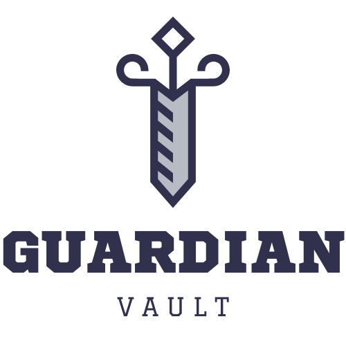

# Aplikacja do Zarządzania Domem Dziecka

## Opis Projektu

Aplikacja do Zarządzania Domem Dziecka została stworzona w celu ułatwienia opiekunom zastępczym fundacji ROZ zarządzania dokumentacją dzieci, którymi się opiekują. Dzięki tej aplikacji opiekunowie mogą łatwo dodawać, przeglądać, edytować i usuwać informacje o dzieciach oraz ich dokumentację.

## Technologie

Projekt został stworzony przy użyciu następujących technologii:

- Frontend:
  - React.js
  - CSS (z wykorzystaniem JSS)
- Backend:
  - Django
  - Django REST Framework
  - PostgreSQL
- Docker